# 09 — Interoperability (Pass F)

*Part of the [Coding-Agent Harness Study](../README.md) · snapshot 2026-08-04 · citations pinned to the commits in [00-scope](00-scope.md).* Pairings below are assessed from handshake code, not live runs; live pairing tests are routed to [10-benchmark-design](10-benchmark-design.md) (T9 + integration smoke suggestions below).

Verified protocol surfaces (handshake code, not README badges — citations in dossiers §F and ledger 11):

| Subject | MCP client | MCP server | ACP agent (drivable) | ACP client (drives others) | Other embed surfaces |
|---|---|---|---|---|---|
| opencode | SDK 1.29.0 → rev **2025-11-25** (external); roots-only caps, sampling/elicitation disabled (`src/mcp/index.ts:39-50,219-232`) | no | **v1**, fork/list/resume/close (`src/acp/service.ts:112-136`) | no | Hono HTTP+SSE + generated SDK; `run --attach`; GitHub Action |
| goose | rmcp 3.0.0 → rev **2025-11-25** (external) (`agents/mcp_client.rs:612-648`) | yes (`goose mcp <name>`, rmcp stdio) | crate 1.0, stdio + HTTP/WS w/ X-Secret-Key (`acp/server.rs:1427-1485`) | **yes** — claude/codex/copilot/amp/pi ACP + CLI-wrapper providers (`acp/provider.rs:50-68,1029-1068`) | uniffi Py/Kotlin SDK; session import from Claude Code/Codex/Pi jsonl |
| OpenHands | fastmcp≥3.0.0 (rev delegated) (`sdk/mcp/client.py:24-60`) | partial (mcp_router in agent-server) | no | **yes** — ACPAgent runs Claude Code/Codex/Gemini as the whole engine (`agent/acp_agent.py:1-53`); Canvas drives any ACP agent | agent-server REST/WS (OpenAPI, x-session-api-key); DockerWorkspace per-worker servers |
| pi | none (by philosophy) | none | none | none | Node SDK; JSONL-RPC stdio mode; experimental CBOR server |
| mini-swe-agent | none | none | none | none | YAML config; trajectory JSON; importable Python classes |
| cline | core: stdio-only **2024-11-05** (`extensions/mcp/client.ts:44`); ext: official SDK all transports | no | via CLI `--acp` (`apps/cli/src/acp/acpAgent.ts`) | no | published npm SDK; hub WS daemon; legacy gRPC hostbridge |

## Candidate combinations

Assessment fields: works today? · mechanism · adapters needed · semantic mismatches · useful or merely possible?

### 1. Goose ↔ OpenCode via ACP
**Works today, both directions, with a version caveat.** Goose-drives-opencode: goose's ACP client spawns external agents (`acp/provider.rs`), and `opencode acp` is an ACP agent at protocolVersion 1; goose even ships an `opencode_go` declarative provider entry. Opencode-drives-goose does **not** exist (opencode has no ACP client role) — the reverse pairing is opencode-as-editor-frontend? No: opencode's ACP is agent-role only, so the only two-way composition is goose(client)→opencode(agent). Mismatches: permission models don't federate — goose sees one opaque "model" stream; opencode's ask-prompts must be pre-resolved by ruleset (`--auto`-equivalent config) or the pipeline stalls; session forking semantics differ (opencode fork-by-message vs goose fork-on-resume). **Useful** when goose's recipes/scheduler orchestrate and opencode does the coding; token cost doubles context (both harnesses maintain transcripts).

### 2. Goose orchestrating OpenHands workers
**Possible today via two seams, neither purpose-built.** (a) ACP: OpenHands has no ACP *agent* role, so goose cannot drive it as an ACP provider — this pairing is **not** available despite both being "ACP projects" (goose is agent+client, OpenHands is client-only: complementary in the wrong direction). (b) REST: each DockerWorkspace exposes an agent-server (ports 30000-39999); a goose recipe/extension could drive it over HTTP as a generic tool (via an MCP bridge or shell+curl). Adapters: an MCP server wrapping the agent-server OpenAPI (mechanical; the curated OpenAPI doc exists). Mismatches: OpenHands confirmation policies and condenser run inside the worker, invisible to goose; lifecycle (pause/stuck/budget) is per-worker. **Useful** for fleet patterns (goose scheduler + N sandboxed workers) but today it's an integration project, not a configuration.

### 3. OpenCode inside an OpenHands sandbox
**Works today, mechanically.** The agent-server image best-effort installs Node 22 precisely so third-party agents can run inside the sandbox (`Dockerfile:156-203`), and bash_router/exec allows arbitrary processes; opencode is a single binary + env key. Two composition depths: (a) opencode as a shell process the OpenHands agent invokes (trivial, no protocol); (b) opencode replacing the engine via ACPAgent — **blocked**: ACPAgent speaks ACP and opencode's ACP agent exists, so this *should* work (`ACPAgent` was built for Claude Code/Codex/Gemini; opencode is protocol-compatible at v1). Caveat: the acp<0.11 pin drama (app defaults.json) shows ACP library churn breaks these pairings across versions. Mismatches: double state (opencode SQLite in-container vs OpenHands event log records only ACP turns); OpenHands permissions see one opaque turn. **Useful**: it converts opencode into a container-isolated worker — the missing sandbox opencode itself lacks. Route a live test to 10 (integration smoke).

### 4. Pi prototype → OpenHands deployment
**Possible, one-way, with a rewrite seam.** Nothing speaks a shared protocol (pi: no MCP/ACP). What ports: Skills (pi reads/writes agentskills.io SKILL.md; OpenHands consumes the same format), AGENTS.md, and plain-file state. What doesn't: pi extensions (TS, in-process) have no OpenHands equivalent — they'd become SDK tools (Python rewrite); pi session JSONL trees are importable nowhere (goose imports pi sessions; OpenHands doesn't). Realistic flow: prototype the *procedure* in pi (skills + files + templates), then re-implement active pieces as OpenHands tools/hooks. **Useful as a methodology pipeline, merely-possible as a code pipeline.**

### 5. Cline engine embedded elsewhere sharing MCP servers
**Works today for embedding; MCP sharing is config-level, with a capability cliff.** `@cline/core` et al. are published and consumed by two in-repo hosts + ACP; embedding = `new Agent({providerId, modelId, apiKey, tools})`. The `mcpServers` JSON shape is the de-facto cross-harness standard (same shape opencode/goose/OpenHands accept), so *server configs* are shareable. Cliff: headless cline (SDK core client) is stdio-only at 2024-11-05 — HTTP-transport servers configured for the IDE silently don't exist headless. Mismatches: SDK auto-approves unlisted tools by default — embedders sharing MCP servers inherit a permissive default. **Useful** (it's the shipped architecture), pre-1.0 churn is the tax.

### 6. Skills reused across harnesses
**Works today — the strongest portability result in the study.** Five of six implement agentskills.io SKILL.md (all but mini-swe-agent), and three explicitly read *shared/foreign* skill dirs: goose `~/.agents/skills`, pi mounts `~/.claude/skills`/`~/.codex/skills`, opencode discovers Claude-compatible dirs. Mismatches are behavioral, not format: activation differs (OpenHands trigger-injection vs opencode skill-tool vs pi model-optional reading — pi docs admit models must sometimes be forced via `/skill:name`), so a portable skill must assume *lazy, model-initiated* loading and keep the procedure re-entrant. **Useful now.**

### 7. AGENTS.md as common policy
**Works today, 5/6** (all but mini-swe-agent, where the instance template is the equivalent). All five also read CLAUDE.md or legacy equivalents; nesting/global variants differ (opencode: lazy nested + remote URLs; goose: nested + global; pi: ancestors + worktree shadowing; cline: workspace + global; OpenHands: repo skill). Mismatch: *when* it loads (always vs lazily on directory touch) and whether it survives compaction (opencode/goose re-attach; OpenHands keeps it in the dynamic system tier). **Useful now; it is the policy layer.**

### 8. MCP as shared tool layer
**Works today for 4/6 clients with revision skew** (2024-11-05 → 2025-11-25 negotiated; nobody at 2026-07-28). Server-side only goose (bundled) and OpenHands (router) exist. pi and mini-swe abstain — for pi, deliberately (CLI-tools-with-READMEs + skills as the alternative). Semantic mismatches: capability asymmetry (opencode disables sampling/elicitation; cline-core lacks HTTP transports), permission naming (`server__tool` vs per-server rules), OAuth handling. **Useful and real, but "MCP support" is not one thing — test T9 must record negotiated revision + transport per harness.**

### 9. ACP as agent/client layer
**Working today with a lopsided topology:** agents (drivable): opencode, goose, cline; clients (drivers): goose, OpenHands(+Canvas). Goose is the only both-roles node, making it the natural broker. Version churn is the documented hazard (OpenHands app pins acp<0.11 after a breaking argument reorder; goose crate 1.0 vs opencode SDK 0.21.0 vs protocol v1 — negotiation covers it today). Semantic mismatches: permission federations (each agent's internal gates are invisible to the client), context (client can't see/manage the agent's compaction), lifecycle (fork/resume capabilities differ per agent). **Useful now for editor-embedding and agent-as-provider; fragile across upgrades.**

### 10. mini-swe-agent as measurement baseline
**Works today; it is designed for exactly this.** Batch runner emits SWE-bench-official preds.json; environment classes give per-task containers; YAML controls everything. To baseline *other* harnesses: reuse its (SHA, prompt, validator) task pattern and its trajectory JSON as the common metrics format (10-benchmark already adopts this). Only mismatch: its default now uses tool-calling (see 00-scope correction) — the "no-tool-calling baseline" claim must not be repeated.

### 11. A portable workflow layered over all six
**Feasible today at the file layer; enforcement is per-harness.** Common substrate all six honor: files as state, git as history, shell as verification executor. 5/6 add AGENTS.md + SKILL.md natively; MCP optional on 4/6. The workflow's *procedure* (skills+files) ports; its *enforcement* does not — each harness needs a thin native adapter for gates: opencode permission rulesets/plugin hook; goose recipe retry-checks + Stop hooks + review checks; OpenHands hooks + critic + confirmation policy; cline ToolPolicies + subprocess hooks; pi extension (`tool_call` block); mini-swe: none (template-only, model self-policed). Full verdict in 12 §5.

## Layer diagram

```mermaid
flowchart TB
  subgraph clients["CLIENT / UI LAYER"]
    OCui["opencode TUI · web · Electron · VS Code · Slack"]
    GSui["goose CLI · Electron · npm TUI · Telegram"]
    Canvas["OpenHands Agent Canvas (drives ANY ACP agent)"]
    CLui["cline VS Code ext · CLI/TUI · hub dashboard"]
    Zed["Zed / JetBrains / other ACP editors"]
  end

  subgraph workflow["WORKFLOW / ORCHESTRATION LAYER"]
    GSrec["goose recipes + scheduler + review checks"]
    CLcron["cline cron/event automation"]
    OHauto["openhands-automation (schedules/webhooks)"]
  end

  subgraph loops["AGENT-LOOP LAYER"]
    OC["opencode SessionPrompt.runLoop (TS/Effect)"]
    GS["goose Agent::reply (Rust)"]
    OH["openhands-sdk Agent.step (Python)"]
    PI["pi-agent-core runAgentLoop (TS, injectable)"]
    MSA["mini-swe DefaultAgent (190-line control)"]
    CL["cline AgentRuntime (TS, stateless)"]
  end

  subgraph tools["TOOL LAYER"]
    MCP["MCP servers (rev 2024-11-05…2025-11-25 negotiated)"]
    Skills["SKILL.md (agentskills.io) — 5/6"]
    AgentsMD["AGENTS.md policy — 5/6"]
  end

  subgraph runtime["RUNTIME / ISOLATION LAYER"]
    Host["host exec (default everywhere)"]
    Docker["containers: OpenHands DockerWorkspace · mini-swe envs (docker/singularity/bubblewrap) · goose opt-in"]
    K8s["k8s/VM: Canvas helm · agent-server fleets"]
  end

  subgraph verify["VERIFICATION LAYER"]
    Tests["tests/linters via shell (all six)"]
    Gates["goose retry-checks · OH critic+hooks · cline verified-flag"]
    Bench["mini-swe SWE-bench runner (control arm)"]
  end

  Zed -- "ACP v1" --> OC
  Zed -- "ACP" --> GS
  Zed -- "ACP" --> CL
  Canvas -- "ACP client" --> OC
  Canvas -- "REST/WS + typescript-client" --> OH
  GS -- "ACP client (agents-as-providers): claude/codex/copilot/amp/pi" --> OC
  OH -- "ACPAgent (engine swap): Claude Code/Codex/Gemini" --> tools
  OCui -- "HTTP+SSE (OpenAPI SDK)" --> OC
  GSui -- "ACP (stdio/WS)" --> GS
  CLui -- "npm pkgs / hub WS" --> CL
  GSrec --> GS
  CLcron --> CL
  OHauto --> OH
  OC & GS & OH & CL -- "MCP client" --> MCP
  GS -- "MCP server (bundled)" --> MCP
  OC & GS & OH & PI & CL --- Skills
  OC & GS & OH & PI & CL --- AgentsMD
  loops --> Host
  OH --> Docker
  MSA --> Docker
  OH --> K8s
  loops --> Tests
  GS & OH & CL --> Gates
  MSA --> Bench
```

Reading of the diagram: the **loop layer is crowded** (six independent implementations), the **tool/policy file layer is converged** (MCP+SKILL.md+AGENTS.md), the **client layer is converging on ACP**, and the **runtime and verification layers are thin everywhere** — isolation and "requirement demonstrated" are the two layers no project owns end-to-end. Only OpenHands spans loop+runtime+server in one system; only goose spans loop+workflow+both ACP roles.
